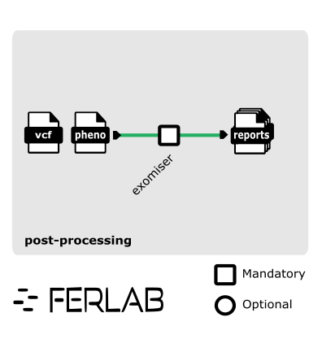

# Ferlab-Ste-Justine/cnv-post-processing

## Introduction

**Ferlab-Ste-Justine/cnv-post-processing** is a bioinformatics pipeline designed for the post-processing of Copy Number Variants (CNVs).  Currently, the pipeline integrates [Exomiser](https://exomiser.readthedocs.io/en/14.0.0/running.html) for variant prioritization. We might support additional tools and steps in the future.

## Pipeline Summary

There is currently a single step in the pipeline, which consists in running an exomiser analysis for each pair of vcf, phenopacket files in the sample sheet.



This schema was done using [inkscape](https://inkscape.org/) with the good pratices recommended by the nf-core community. See [nf-core Graphic Design](https://nf-co.re/docs/guidelines/graphic_design).

## Usage

Run the pipeline locally using the test profile with Docker:
```bash
nextflow run . -profile test,docker --outdir results
```

Run the pipeline in a production environment with a specific configuration and parameters:
```bash
nextflow -c application.config run Ferlab-Ste-Justine/cnv-post-processing \
    -r v1.0.0 \
    --input samplesheet.csv \
    --outdir results \
    -params-file params.json
```

For more details, see:
- [docs/usage.md](docs/usage.md) for instructions on how to run the pipeline, including input requirements and examples
- [docs/reference_data.md](docs/reference_data.md) for information about the reference data required by the pipeline


## Credits

Ferlab-Ste-Justine/cnv-post-processing was originally written by Lysiane Bouchard, Georgette Femerling, Félix-Antoine Le Sieur, David Morais.

We would like to thank the entire Ferlab team and its partners for their support and collaboration in the development of this pipeline. Their contributions, feedback, and expertise have been invaluable in ensuring the success of this project.

## Contributions and Support

If you would like to contribute to this pipeline, please see the [contributing guidelines](.github/CONTRIBUTING.md).

## Citations

An extensive list of references for the tools used by the pipeline can be found in the [`CITATIONS.md`](CITATIONS.md) file.

This pipeline uses code and infrastructure developed and maintained by the [nf-core](https://nf-co.re) community, reused here under the [MIT license](https://github.com/nf-core/tools/blob/main/LICENSE).

> **The nf-core framework for community-curated bioinformatics pipelines.**
>
> Philip Ewels, Alexander Peltzer, Sven Fillinger, Harshil Patel, Johannes Alneberg, Andreas Wilm, Maxime Ulysse Garcia, Paolo Di Tommaso & Sven Nahnsen.
>
> _Nat Biotechnol._ 2020 Feb 13. doi: [10.1038/s41587-020-0439-x](https://dx.doi.org/10.1038/s41587-020-0439-x).
