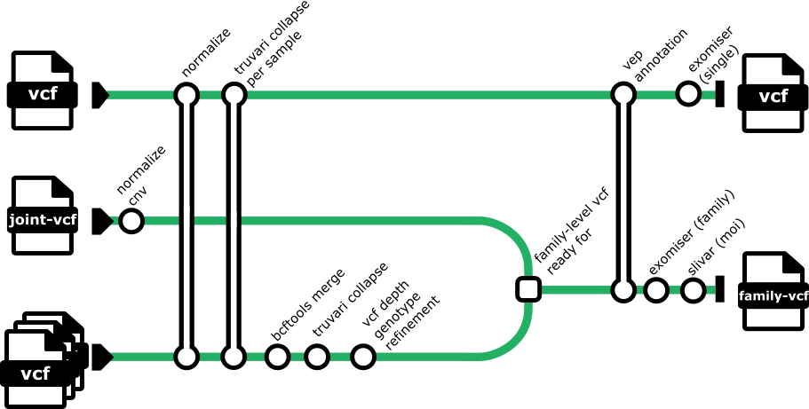

# Ferlab-Ste-Justine/cnv-post-processing

## Introduction

**Ferlab-Ste-Justine/cnv-post-processing** is a bioinformatics pipeline designed for the post-processing of Copy Number Variants (CNVs), from per-sample VCFs to family-level, annotated and prioritized calls. It normalizes and collapses CNV calls, merges samples into families (or reuses an already jointly-called family VCF), resolves missing genotypes from alignment depth, annotates variants with [Ensembl VEP](https://www.ensembl.org/info/docs/tools/vep/index.html), prioritizes them with [Exomiser](https://exomiser.readthedocs.io/en/14.0.0/running.html), and classifies mode of inheritance with [slivar](https://github.com/brentp/slivar). Standalone samples with no family or pedigree information get their own lightweight VEP + Exomiser route instead of the family-level one. We might support additional tools and steps in the future.

## Pipeline Summary

1. Per-sample CNV normalization ([bcftools](https://samtools.github.io/bcftools/bcftools.html)) and redundant-call collapsing ([truvari](https://github.com/ACEnglish/truvari))
2. Family-level merge of per-sample VCFs and cohort-level collapsing -- families provided as an already jointly-called, multi-sample VCF (e.g. DRAGEN joint calling) skip merging/collapsing entirely
3. Depth-based genotype refinement ([mosdepth](https://github.com/brentp/mosdepth)) to resolve missing genotypes at cohort-collapsed sites, for families where every sample has an alignment file (CRAM/BAM)
4. Variant annotation with [Ensembl VEP](https://www.ensembl.org/info/docs/tools/vep/index.html), at the family level, and separately for standalone samples
5. Variant prioritization with [Exomiser](https://exomiser.readthedocs.io/en/14.0.0/running.html) from a phenopacket, at the family level and the standalone-sample level
6. Mode-of-inheritance classification with [slivar](https://github.com/brentp/slivar), for families with a pedigree (PED) file



This schema was done using [inkscape](https://inkscape.org/) with the good pratices recommended by the nf-core community. See [nf-core Graphic Design](https://nf-co.re/docs/guidelines/graphic_design).

## Usage

Run the pipeline locally using the test profile with Docker:
```bash
nextflow run . -profile test,docker --outdir results
```

Run the pipeline in a production environment with a specific configuration and parameters:
```bash
nextflow -c application.config run Ferlab-Ste-Justine/cnv-post-processing \
    -r v1.0.0 \
    --input samplesheet.csv \
    --outdir results \
    -params-file params.json
```

For more details, see:
- [docs/usage.md](docs/usage.md) for instructions on how to run the pipeline, including input requirements and examples
- [docs/reference_data.md](docs/reference_data.md) for information about the reference data required by the pipeline


## Credits

Ferlab-Ste-Justine/cnv-post-processing was written by Julien Tremblay, Lysiane Bouchard, Georgette Femerling, Félix-Antoine Le Sieur, David Morais.

We would like to thank the entire Ferlab team and its partners for their support and collaboration in the development of this pipeline.

## Contributions and Support

If you would like to contribute to this pipeline, please see the [contributing guidelines](.github/CONTRIBUTING.md).

## Citations

An extensive list of references for the tools used by the pipeline can be found in the [`CITATIONS.md`](CITATIONS.md) file.

This pipeline uses code and infrastructure developed and maintained by the [nf-core](https://nf-co.re) community, reused here under the [MIT license](https://github.com/nf-core/tools/blob/main/LICENSE).

> **The nf-core framework for community-curated bioinformatics pipelines.**
>
> Philip Ewels, Alexander Peltzer, Sven Fillinger, Harshil Patel, Johannes Alneberg, Andreas Wilm, Maxime Ulysse Garcia, Paolo Di Tommaso & Sven Nahnsen.
>
> _Nat Biotechnol._ 2020 Feb 13. doi: [10.1038/s41587-020-0439-x](https://dx.doi.org/10.1038/s41587-020-0439-x).
